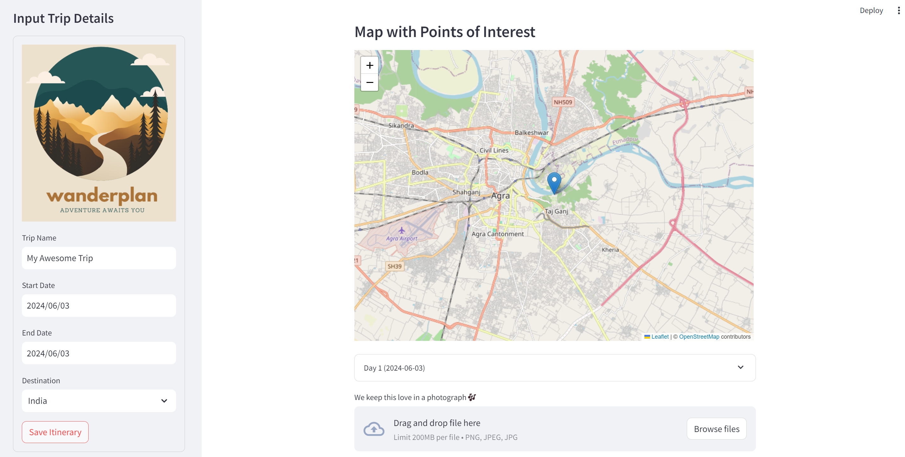

# WanderPlan

## Overview

Welcome to Wanderlust Adventures! This website is your ultimate guide to exploring the world. Whether you're a seasoned traveler or planning your first trip, Wanderlust Adventures offers comprehensive travel guides, tips, and inspiration to help you make the most of your journeys. Our mission is to provide travelers with the resources they need to discover new destinations, experience different cultures, and create unforgettable memories.

Travel Itinerary App
This is a Streamlit application for planning and visualizing travel itineraries. Users can input trip details such as trip name, start and end dates, select a destination, and add activities for each day of the trip. The app also provides a map with points of interest (POIs) for the selected destination.

Features
1.Input trip details: Trip name, start date, end date, and destination.
2.Add activities for each day of the trip.
3.View a map with points of interest for the selected destination.
4.Upload and display images for the trip.

Dependencies
Streamlit: Web framework for building interactive web applications with Python.
Folium: Python wrapper for Leaflet.js, a JavaScript library for interactive maps.
Streamlit-Folium: Streamlit component for displaying Folium maps in Streamlit apps.
Geopy: Python library for geocoding and reverse geocoding.